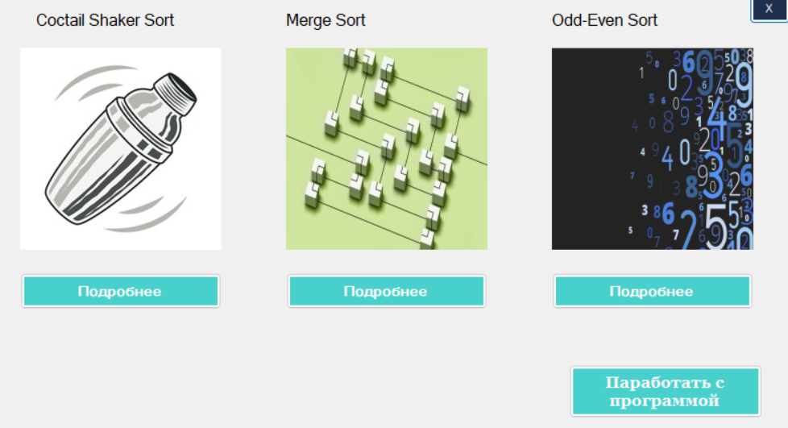
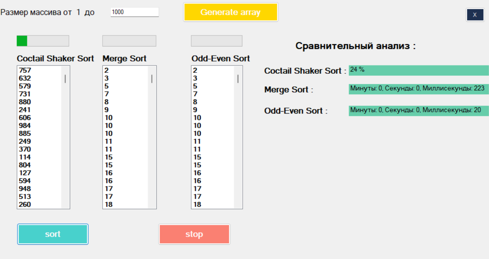

## Программа для визуализации сортировки чисел

### Эта программа демонстрирует работу различных алгоритмов сортировки чисел: Cocktail Sort, Merge Sort и Odd-Even Sort с использованием Windows Forms.

## Функциональность
- Генерация чисел для сортировки 
- Выбор всех алгоритмов
- Визуализация процесса сортировки в реальном времени

  

### Алгоритмы
##### Cocktail Sort
- Этот алгоритм является двунаправленным вариантом пузырьковой сортировки. Элементы перемещаются по массиву в обоих направлениях, пока не отсортируются.

##### Merge Sort
- Рекурсивный алгоритм "разделяй и властвуй", который делит массив на две части, сортирует их по отдельности, а затем объединяет.

##### Odd-Even Sort
- Алгоритм, который работает путём сравнения и обмена пар элементов, сначала всех нечётных пар, затем чётных. 
